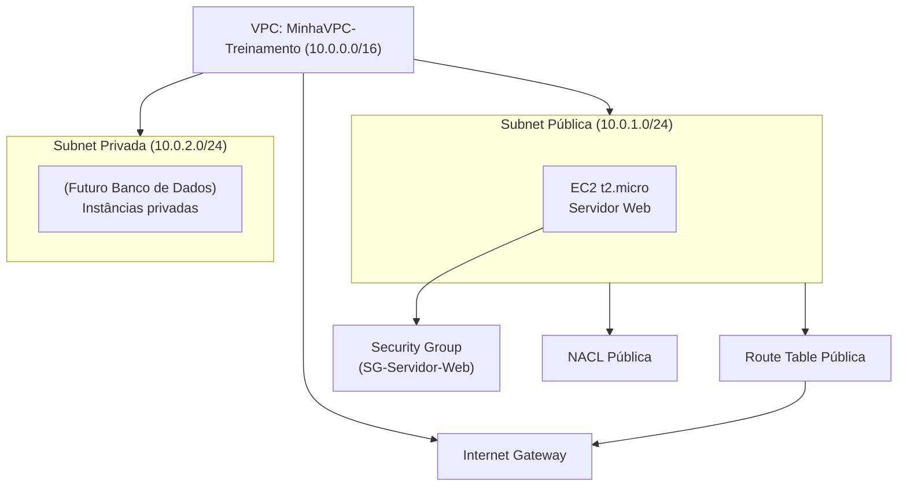
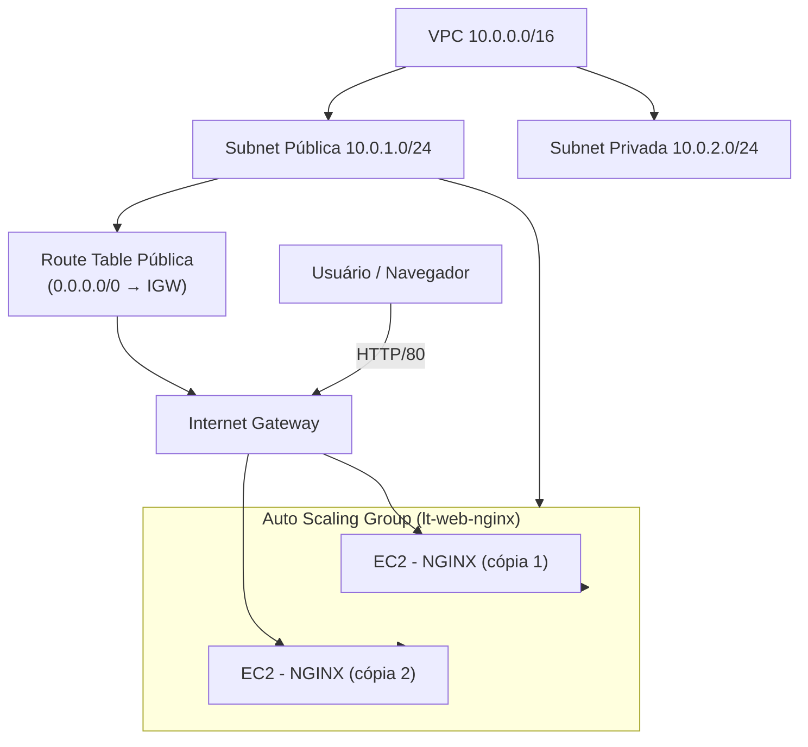
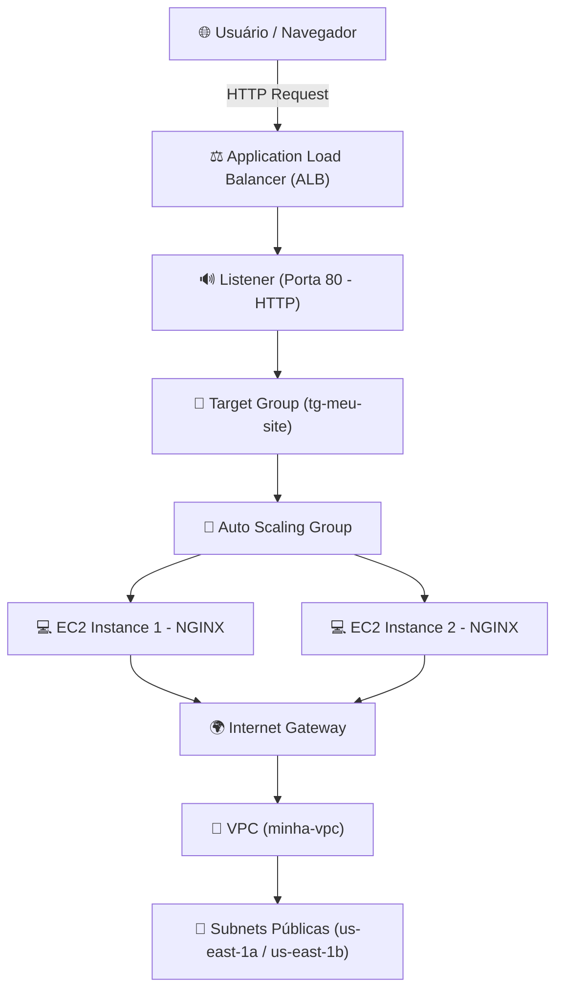

# 🌩️ Criação de Conta AWS no Free Tier + Boas Práticas

## 🎯 Objetivo
- Criar uma conta AWS no **modo Free Tier**.  
- Aplicar **boas práticas de segurança** desde o início.  
- Configurar **monitoramento de custos** para evitar cobranças fora do Free Tier.  

---

## 📘 Conceito Básico
A **AWS Free Tier** é a camada gratuita da AWS que permite **aprender e testar serviços** sem custo por até 12 meses (com limites definidos).  
Alguns serviços são **sempre gratuitos** (ex.: IAM, CloudFormation), enquanto outros têm limite mensal (ex.: 750 horas de EC2 t2.micro, 5 GB de S3).  

> ⚠️ O Free Tier não impede a criação de recursos pagos, por isso é essencial aplicar **boas práticas de segurança** e configurar **alarmes de custo**.

---

## 🛠️ Passo a Passo para Criar Conta AWS (Free Tier)

### 1) Criar Conta
1. Acesse [AWS Free Tier](https://aws.amazon.com/free).  
2. Clique em **Create a Free Account**.  
3. Preencha os dados:
   - E-mail válido.  
   - Senha segura.  
   - Nome da conta (ex.: `MeuLabAWS`).  
4. Selecione **Plano Free Tier**.  
5. Adicione cartão de crédito (obrigatório, mas sem cobrança se ficar dentro dos limites).  
6. Valide identidade via SMS.  
7. Faça login no **AWS Management Console**.

---

### 2) Ativar Acesso ao Billing
1. No console, clique em seu nome (canto superior direito).  
2. Vá em **Account → IAM User and Role Access to Billing Information**.  
3. Ative a opção para permitir que usuários IAM visualizem **custos e faturas**.  

---

## ✅ Boas Práticas de Primeiros Passos

### 🔐 1) Ativar MFA na Conta Root
- Vá em **IAM → Users → Security Credentials**.  
- Configure **MFA (Multi-Factor Authentication)**.  
- Use o aplicativo **Google Authenticator** ou **Authy** no celular.  

Isso evita acesso não autorizado mesmo que sua senha seja comprometida.

---

### 👤 2) Criar Usuário IAM para Administração
Nunca use a conta root no dia a dia.

1. No console, vá em **IAM → Users → Add user**.  
2. Nome do usuário: `admin`.  
3. Marque **Acesso ao Console**.  
4. Atribua permissões: **AdministratorAccess**.  
5. Salve o usuário e faça login com ele.  
6. Guarde a URL de login do IAM (ex.: `https://123456789012.signin.aws.amazon.com/console`).  

---

### 📊 3) Criar Alarme de Custo (via Console)
1. Acesse **Billing → Budgets → Create Budget**.  
2. Escolha **Cost Budget**.  
3. Nome: `AlertaCustosAWS`.  
4. Valor limite: `1` (um dólar).  
5. Período: **Mensal**.  
6. Configurar alerta para enviar **e-mail**.  
7. Confirme o e-mail recebido do **SNS**.  

---

# 🌐 Criando uma VPC na AWS

Agora que já temos a conta criada e segura, vamos aprender a construir uma **rede virtual na AWS** (VPC – Virtual Private Cloud) diretamente pelo **console da AWS**.  
Essa parte é essencial porque praticamente todos os serviços da AWS precisam estar conectados a uma rede.

⚠️ **Aviso sobre custos**:  
- **VPC, Subnets, Route Tables, Internet Gateway e Security Groups** → **são gratuitos**.  
- O que gera custo são **recursos dentro da VPC** (ex.: EC2, NAT Gateway, VPN).  
- Então pode criar sem preocupação, desde que não adicione NAT Gateway ou instâncias pagas.

---

## 1. Criando a VPC

Ao clicar em **Create VPC**, aparecem algumas opções:

### 🔹 VPC Settings
- **Resources to create**:
  - **VPC only** → cria apenas a rede base, sem subnets ou outros recursos.
  - **VPC and more** → cria automaticamente a VPC com subnets, roteamento e Internet Gateway. Útil para quem quer tudo pronto rapidamente, mas perde o controle detalhado.
  - **VPC and subnets (IPv6)** → cria a rede já com suporte a IPv6 configurado.

👉 Para aprendizado, usamos **VPC only**, pois montamos tudo manualmente.

---

### 🔹 Name tag
- Um **nome amigável** para identificar sua VPC. Ex.: `MinhaVPC-Treinamento`.  
- Essa tag não altera nada funcionalmente, apenas organização.

---

### 🔹 IPv4 CIDR block
- Define o **bloco de endereços IP privados** que sua VPC vai usar.
- Esse bloco precisa estar em formato **CIDR (Classless Inter-Domain Routing)**, ex.: `10.0.0.0/16`.
- O `/16` significa que a rede terá **65.536 endereços possíveis** (`10.0.0.0` até `10.0.255.255`).

📌 **Regras importantes para o IPv4 CIDR:**
- Precisa ser **um bloco privado**, ou seja, dentro das faixas reservadas para redes internas:
  - `10.0.0.0 – 10.255.255.255 (10/8)`  
  - `172.16.0.0 – 172.31.255.255 (172.16/12)`  
  - `192.168.0.0 – 192.168.255.255 (192.168/16)`  
- Não pode sobrepor outra VPC que já exista na mesma região e que tenha conexão (peering/VPN).
- Quanto menor o número depois da barra (`/`), maior será a quantidade de IPs.

Exemplos:
- `/16` → 65.536 IPs (comum para uma VPC inteira).  
- `/24` → 256 IPs (comum para subnets).  

📌 **Importante**: Dentro da AWS, de cada subnet criada, **5 IPs sempre são reservados** e não podem ser usados:
- O primeiro (`.0`) → identificador da rede.  
- O segundo → reservado pela AWS.  
- O terceiro → reservado pela AWS.  
- O penúltimo → reservado pela AWS.  
- O último (`.255`) → broadcast.  

---

### 🔹 IPv6 CIDR block
- Permite habilitar **endereços IPv6** (128 bits).  
- Hoje em dia, poucos cenários exigem isso, mas é usado para ambientes globais que precisam de **endereços públicos infinitos**.
- Pode ser:
  - **Amazon provided IPv6 CIDR block** → a AWS gera automaticamente um prefixo.  
  - **Do not assign IPv6 CIDR block** → sem IPv6 (padrão para estudos).  

---

### 🔹 Tenancy
- Define como as instâncias EC2 vão ser executadas na sua VPC:
  - **Default** → instâncias compartilham hardware físico (mais barato).  
  - **Dedicated** → cada instância roda em hardware exclusivo (custa mais caro).  
  - **Host** → você reserva um host físico inteiro (custo muito alto).  

👉 Para Free Tier, **sempre use Default**.

---

## 2. Criando Subnets

Cada VPC precisa ser dividida em **subnets**.

### 🔹 Name tag
- Nome amigável para organização, ex.: `Subnet-Publica-1`.

---

### 🔹 VPC
- Escolha a VPC onde a subnet será criada.  
- Uma subnet só pode existir dentro de **uma única VPC**.

---

### 🔹 Availability Zone
- Cada região (ex.: São Paulo – `sa-east-1`) tem várias **AZs (Availability Zones)**.  
- Exemplo em São Paulo:
  - `sa-east-1a`
  - `sa-east-1b`
  - `sa-east-1c`

- **Boas práticas**: espalhar subnets em **AZs diferentes** para alta disponibilidade.

---

### 🔹 IPv4 CIDR block
- Define a faixa de IPs da subnet.  
- Ex.: se a VPC tem `10.0.0.0/16`, você pode dividir em:
  - `10.0.1.0/24` → 256 IPs para a Subnet Pública.  
  - `10.0.2.0/24` → 256 IPs para a Subnet Privada.  

👉 Subnets não podem se sobrepor e precisam caber dentro do CIDR da VPC.

---

### 🔹 IPv6 CIDR block (opcional)
- Se ativou IPv6 na VPC, pode associar aqui também.  

---

## 3. Internet Gateway (IGW)

Um **IGW** conecta a VPC à internet.  

### 🔹 Name tag
- Nome do recurso. Ex.: `IGW-Treinamento`.

### 🔹 Attach to VPC
- Você precisa associar o IGW a **uma única VPC**.  
- Uma VPC pode ter só **um IGW ativo por vez**.  

👉 Sem o IGW, a VPC é isolada e não acessa a internet.

---

## 4. Route Tables

As **Route Tables** definem como os pacotes de rede vão ser roteados.

### 🔹 Name tag
- Ex.: `RT-Publica`.

### 🔹 VPC
- Define em qual VPC a tabela vai existir.

### 🔹 Routes
- Onde você define as **rotas de saída**.  
- Exemplo de rotas comuns:
  - `10.0.0.0/16 → local` (padrão, permite comunicação dentro da VPC).  
  - `0.0.0.0/0 → IGW` (toda internet vai sair pelo Internet Gateway).  
  - `0.0.0.0/0 → NAT Gateway` (quando subnet privada precisa sair para internet de forma controlada – **gera custo**).  

### 🔹 Subnet Associations
- Você escolhe quais subnets usam essa tabela de rotas.  
- Exemplo:
  - `RT-Publica` associada à Subnet Pública.  
  - `RT-Privada` associada à Subnet Privada.  

---

## 5. Security Groups

Os **Security Groups (SG)** funcionam como **firewalls de instância**.

### 🔹 Name tag
- Ex.: `SG-Servidor-Web`.

### 🔹 VPC
- Define em qual rede (VPC) esse SG pode ser usado.

### 🔹 Inbound Rules (Entrada)
- Define quais conexões **são permitidas para entrar** na instância.  
- Exemplos comuns:
  - **SSH (22)** → apenas seu IP (`My IP`).  
  - **HTTP (80)** → de qualquer lugar (`0.0.0.0/0`).  
  - **HTTPS (443)** → de qualquer lugar (`0.0.0.0/0`).  

### 🔹 Outbound Rules (Saída)
- Define o que pode **sair da instância para a rede**.  
- Padrão é `All traffic (0.0.0.0/0)` → qualquer saída é permitida.  

👉 **Boas práticas**: sempre permitir o mínimo necessário.

---

## ✅ O que temos até agora
- **1 VPC (`10.0.0.0/16`)**  
- **1 Subnet Pública (`10.0.1.0/24`)** com acesso à internet  
- **1 Subnet Privada (`10.0.2.0/24`)** sem acesso externo  
- **1 Internet Gateway** ligado à VPC  
- **1 Route Table** conectando a Subnet Pública ao IGW  
- **1 Security Group** para controlar acesso ao servidor 
 
---

# 🔒 Network ACLs (NACLs) – Conceito e Configuração

Além dos **Security Groups (SGs)**, a AWS fornece também as **Network ACLs (NACLs)**.  
Elas funcionam como **firewalls de rede**, aplicados **a nível de Subnet**, não de instância.

---

## 1. Diferença entre Security Group e NACL
| Característica              | Security Group (SG)            | Network ACL (NACL)             |
|------------------------------|--------------------------------|--------------------------------|
| **Escopo**                  | Nível de **instância** (EC2, ENI) | Nível de **subnet**            |
| **Estado (stateful)**       | **Stateful** → se permite entrada, a saída é automaticamente liberada | **Stateless** → precisa configurar entrada e saída separadamente |
| **Regra padrão**            | Tudo **negado** até liberar     | Tudo **permitido** até bloquear |
| **Ordem de avaliação**      | Avalia todas as regras juntas   | Avalia em **ordem numérica** (regra 100, 200, etc.) |
| **Uso comum**               | Controlar acesso direto às instâncias | Camada extra de segurança na Subnet |

---

## 2. Criando uma NACL
1. No console da AWS, acesse **VPC → Network ACLs → Create Network ACL**.  
2. Preencha:
   - **Name tag**: `NACL-Publica`
   - **VPC**: `MinhaVPC-Treinamento`
3. Clique em **Create Network ACL**.

---

## 3. Configurando Regras da NACL

### 🔹 Inbound Rules (Entrada)
- `Rule 100` → **Allow 0.0.0.0/0 TCP 80** (permite HTTP).  
- `Rule 110` → **Allow 0.0.0.0/0 TCP 22** (permite SSH).  
- `Rule *` (padrão) → **Deny All**.  

### 🔹 Outbound Rules (Saída)
- `Rule 100` → **Allow 0.0.0.0/0 All Traffic**.  
- `Rule *` (padrão) → **Deny All**.  

---

## 4. Associando a NACL a uma Subnet
- No menu da NACL, vá em **Subnet Associations**.  
- Associe a `Subnet-Publica-1`.  
- Assim, todo tráfego dessa subnet passa pelas regras da NACL.

---

# 💻 Criando uma Instância EC2 (Free Tier)

Agora que temos a rede pronta, vamos colocar uma **máquina virtual EC2** nela.

---

## 1. Serviço EC2
- Acesse **EC2 → Instances → Launch Instance**.

---

## 2. Nome da Instância
- Exemplo: `EC2-Treinamento`.

---

## 3. Escolher AMI (Amazon Machine Image)
- **Amazon Linux 2 (Free Tier)** ou **Ubuntu Server 22.04 LTS**.  
- Essas imagens estão no **nível gratuito**.  

---

## 4. Tipo de Instância
- Selecione **t2.micro** ou **t3.micro** (Free Tier).  

---

## 5. Par de Chaves (Key Pair)
- Selecione **Create new key pair** → Nome: `treinamento-key`.  
- Baixe o arquivo `.pem` (guarde bem, pois será usado no SSH).  

---

## 6. Configurações de Rede
- **VPC**: escolha `MinhaVPC-Treinamento`.  
- **Subnet**: `Subnet-Publica-1`.  
- **Auto-assign Public IP**: **Enable** (precisa de IP público para acessar via internet).  
- **Firewall (Security Group)**: selecione `SG-Servidor-Web`.  

---

## 7. Armazenamento
- O Free Tier inclui **30 GB de EBS** grátis.  
- Deixe o padrão (`8 GB gp2`).

---

## 8. Launch
Clique em **Launch Instance**.  
Aguarde alguns minutos até a instância ficar em **Running**.

---

## 9. Conectando via SSH
No terminal local:
```bash
chmod 400 treinamento-key.pem
ssh -i treinamento-key.pem ec2-user@<IP_PUBLICO_DA_EC2>
```

### 10. Diagrama



# Implantando uma Aplicação Web Simples na EC2

Agora que temos a instância **EC2** rodando na **Subnet Pública**, vamos validar se conseguimos **acessar pela internet** implantando um **servidor web simples**.

---

## 1. Acessar a Instância
No seu computador, use o SSH para entrar na EC2:

```bash
ssh -i treinamento-key.pem ec2-user@<IP_PUBLICO_DA_EC2>
```

## 2. Instalar e iniciar o NGINX

```bash
sudo dnf update -y
sudo dnf install nginx -y
sudo systemctl start nginx
sudo systemctl enable nginx
```
## 3. Verifique o Status

```bash
systemctl status nginx
```

## 3. Testar no navegador

Acesse:
👉 http://IP-PUBLICO-EC2

Se aparecer a tela padrão do NGINX, significa que:
✅ Sua EC2 está funcionando.
✅ O tráfego de Internet está liberado.
✅ O Security Group está configurado corretamente.

# Trabalhando com AMIs, Launch Templates e Auto Scaling Groups

Até aqui criamos uma rede, uma instância EC2 e rodamos uma aplicação simples (NGINX).  
Agora vamos aprender como **salvar a configuração dessa instância** para poder recriá-la rapidamente ou escalar automaticamente com grupos de instâncias.

---

## 1. AMI (Amazon Machine Image)

A **AMI** é uma imagem que contém o sistema operacional e, opcionalmente, as aplicações e configurações instaladas.  
Com ela, você pode **recriar novas EC2s idênticas** à que já configurou.

### Criar uma AMI de uma EC2 existente
1. No Console da AWS, vá em **EC2 > Instâncias**.  
2. Clique na instância que deseja salvar.  
3. Vá em **Ações > Imagem e modelos > Criar imagem**.  
4. Preencha:
   - **Nome da imagem**: `ami-web-nginx`  
   - **Descrição**: "AMI com NGINX instalado".  
5. Clique em **Criar imagem**.  

📌 A AWS vai gerar uma nova **AMI** (pode levar alguns minutos).  
📌 Ao criar uma nova instância, você poderá selecionar essa AMI personalizada.  

✅ Assim, não será necessário repetir toda a instalação manual do NGINX.

---

## 2. Launch Templates

Um **Launch Template** é um modelo de configuração para iniciar EC2s.  
Ele pode incluir:
- Tipo da instância (ex: `t2.micro`);  
- AMI (ex: `ami-web-nginx` que criamos);  
- Security Groups;  
- Par de chaves SSH;  
- Subnet e VPC;  
- Tags.  

### Criar um Launch Template
1. Vá em **EC2 > Modelos de inicialização > Criar modelo**.  
2. Nome: `lt-web-nginx`.  
3. Selecione a AMI: `ami-web-nginx`.  
4. Tipo de instância: `t2.micro`.  
5. Security Group: `sg-web`.  
6. Par de chaves: selecione o seu.  
7. Clique em **Criar modelo de inicialização**.  

✅ Agora você tem um modelo pronto para criar instâncias sem precisar configurar tudo novamente.

---

## 3. Auto Scaling Groups (ASG)

O **Auto Scaling Group** permite que você defina **mínimo, máximo e desejado** de instâncias EC2 rodando.  
Ele garante que sempre haverá a quantidade definida e pode escalar para cima ou para baixo conforme a demanda.

### Exemplo prático: Auto Scaling Group para NGINX
1. Vá em **EC2 > Auto Scaling Groups > Criar ASG**.  
2. Nome: `asg-web-nginx`.  
3. Escolha o **Launch Template** `lt-web-nginx`.  
4. Selecione a VPC `minha-vpc` e a subnet pública `subnet-publica-1`.  
5. Defina a capacidade:
   - **Mínimo**: 1 instância.  
   - **Desejado**: 1 instância.  
   - **Máximo**: 2 instâncias.  
6. Configure políticas de escalabilidade (opcional neste momento, para iniciantes podemos deixar sem).  
7. Clique em **Criar grupo de Auto Scaling**.  

✅ Agora, se você **encerrar manualmente a instância**, o ASG cria outra automaticamente.  

---

## 4. Diagrama da Arquitetura com ASG

### 10. Diagrama


# 🧩 Módulo: Application Load Balancer (ALB) na AWS

## 🎯 Objetivo
Neste módulo, vamos:
- Entender o que é e como funciona um **Load Balancer** na AWS.  
- Criar um **Application Load Balancer (ALB)** para distribuir o tráfego entre instâncias EC2 do nosso **Auto Scaling Group**.  
- Ver como o ALB melhora a **alta disponibilidade** e a **tolerância a falhas**.  
- Validar o acesso via **DNS público** gerado automaticamente.  

---

## 🧠 Conceito: O que é um Load Balancer?

Um **Load Balancer** (balanceador de carga) distribui automaticamente o tráfego de entrada (HTTP/HTTPS) entre várias instâncias EC2.

Ele ajuda a:
- Evitar sobrecarga em uma única instância.  
- Garantir disponibilidade mesmo se uma instância falhar.  
- Aumentar a escalabilidade e o desempenho das aplicações.  

A AWS possui **três tipos principais de Load Balancer**:

| Tipo | Camada OSI | Ideal para | Exemplo de uso |
|------|-------------|-------------|----------------|
| **Application Load Balancer (ALB)** | Camada 7 (HTTP/HTTPS) | Aplicações Web | API REST, sites, apps web |
| **Network Load Balancer (NLB)** | Camada 4 (TCP/UDP) | Baixa latência e alta performance | Tráfego de rede, gRPC, jogos online |
| **Gateway Load Balancer (GLB)** | Camada 3 (Rede) | Firewalls e inspeção de tráfego | Segurança de rede, inspeção de pacotes |

👉 **Neste módulo usaremos o ALB**, pois é o mais comum e ideal para aplicações web (HTTP/HTTPS).  

---

## 💰 Custos e Free Tier

- O **AWS Free Tier** inclui **750 horas/mês de uso do Load Balancer por 12 meses**.  
- Isso cobre **um ALB ativo** o mês inteiro.  
- Evite criar vários ALBs simultaneamente.  
- Se passar do limite, a cobrança é pequena (~$0,022 por hora adicional).

---

## 🧱 Passo a Passo — Criando um Application Load Balancer

### 1. Acessar o Console
- Entre no Console AWS.  
- Vá até **EC2** → **Load Balancers** → clique em **Create Load Balancer**.  

### 2. Escolher o Tipo
Na tela de seleção:
- Escolha **Application Load Balancer** → clique em **Create**.

### 3. Configurar Detalhes Básicos
Na seção **Basic configuration**:
- **Name:** `meu-alb`
- **Scheme:**  
  - `Internet-facing` → para acesso público (internet).  
  - `Internal` → usado apenas dentro da VPC.  
  > Usaremos **Internet-facing**.
- **IP address type:** `IPv4`  

### 4. Configurar Rede (Network Mapping)
- **VPC:** selecione sua VPC criada anteriormente (`minha-vpc`).  
- **Mappings:** selecione **duas subnets públicas** (de zonas diferentes, ex: `us-east-1a` e `us-east-1b`).  
  > O ALB precisa de **mínimo 2 subnets públicas** para alta disponibilidade.  

### 5. Configurar Security Groups
- Selecione um **Security Group existente** que permita **porta 80 (HTTP)**.  
  > Se não tiver, crie um novo:
  - **Name:** `sg-alb`
  - **Inbound rule:**  
    - Type: HTTP (porta 80)  
    - Source: 0.0.0.0/0  
  - **Outbound rule:** permitir todo o tráfego (padrão).  

### 6. Listeners e Rotas
Na seção **Listeners**:
- Mantenha o listener padrão:
  - **Protocol:** HTTP  
  - **Port:** 80  
  - **Default action:** `Forward to` → clique em **Create target group**.

---

## 🎯 Criando o Target Group (Grupo de Alvo)

O **Target Group** é o conjunto de instâncias EC2 que receberão tráfego do Load Balancer.

### 1. Criar Target Group
- Tipo: **Instances**  
- **Name:** `tg-meu-site`  
- **Protocol:** HTTP  
- **Port:** 80  
- **VPC:** selecione sua VPC  

### 2. Health Checks
- **Protocol:** HTTP  
- **Path:** `/` (página principal)  
> O ALB usa esse caminho para checar se a aplicação está respondendo corretamente.

Clique em **Next**.

### 3. Registrar Alvos
- Selecione suas instâncias EC2 do Auto Scaling Group (ou instâncias individuais com NGINX).  
- Clique em **Include as pending below**.  
- Depois clique em **Create target group**.

Volte à tela do Load Balancer e selecione o `tg-meu-site` criado.  

---

## ⚙️ Revisar e Criar o ALB

Revise todas as configurações e clique em **Create Load Balancer**.  
A criação leva cerca de **1 a 2 minutos**.

---

## 🔍 Testando o Acesso ao Load Balancer

Após criado:
1. Vá em **EC2 → Load Balancers**.  
2. Clique no `meu-alb`.  
3. Copie o **DNS name** (exemplo: `meu-alb-1234567890.us-east-1.elb.amazonaws.com`).  
4. Cole no navegador → você deve ver a página “Welcome to NGINX!”.  

🎉 Pronto! Você acessou sua aplicação via o Load Balancer.  

---

## 🔎 Observando Health Checks

- Vá em **Target Groups → tg-meu-site → Targets**.  
- Veja o status das instâncias (`healthy` ou `unhealthy`).  
- Se aparecer `unhealthy`, verifique:
  - Porta 80 aberta no Security Group.  
  - NGINX ativo (`sudo systemctl status nginx`).  
  - Health check configurado corretamente.  

---

## 📊 Diagrama da Arquitetura



---

## 🧩 Recapitulando

| Recurso | Função | Observação |
|----------|--------|-------------|
| **VPC** | Rede privada isolada | Define faixa de IP e subnets |
| **Subnets Públicas** | Hospedam recursos acessíveis pela internet | Necessárias para ALB e EC2 públicas |
| **Internet Gateway** | Permite saída/entrada de tráfego público | Associado à VPC |
| **Security Groups** | Controlam acesso (firewall) | Um para ALB e outro para EC2 |
| **Target Group** | Lista de instâncias EC2 | Define health checks |
| **ALB** | Distribui tráfego HTTP/HTTPS | Acesso público via DNS |
| **Auto Scaling Group** | Cria e substitui instâncias | Escalabilidade e resiliência |

---

## ✅ Conclusão

Agora você tem:
- Uma **VPC completa** com subnets públicas.  
- Um **Application Load Balancer** configurado.  
- Um **Auto Scaling Group** com múltiplas EC2 rodando NGINX.  
- Um **acesso público via DNS do ALB** totalmente funcional.  

# 🌐 Módulo: Frontend no S3 + Backends no ALB (EC2 com Auto Scaling)

Neste módulo, vamos construir uma aplicação simples composta por:

- **Frontend** hospedado em um bucket **S3** (modo estático).
- **Dois backends Node.js** hospedados em **EC2s** atrás de um **Application Load Balancer (ALB)**.
- **Roteamento pelo path** `/api` e `/auth` no ALB.

---

## 🧱 Estrutura do Projeto

A estrutura de diretórios será:

```
infra/                          # (opcional) scripts de deploy
frontend/
  ├─ index.html
  └─ app.js
backend-api/
  ├─ api/                       # API 1 (ex.: /api)
  │   ├─ package.json
  │   └─ server.js
  └─ auth/                      # API 2 (ex.: /auth)
      ├─ package.json
      └─ server.js
```

---

## ⚙️ 1. Criando o Frontend Estático

### 📁 Arquivos

**`frontend/index.html`**
```html
<!DOCTYPE html>
<html lang="pt-BR">
<head>
  <meta charset="UTF-8">
  <title>Frontend - ODevOpsEnsina</title>
  <script src="app.js" defer></script>
</head>
<body>
  <h1>Aplicação Frontend no S3</h1>
  <button onclick="chamarAPI()">Chamar API</button>
  <button onclick="chamarAuth()">Chamar Auth</button>
  <p id="resposta"></p>
</body>
</html>
```

**`frontend/app.js`**
```javascript
async function chamarAPI() {
  const resposta = await fetch('/api');
  document.getElementById('resposta').innerText = await resposta.text();
}

async function chamarAuth() {
  const resposta = await fetch('/auth');
  document.getElementById('resposta').innerText = await resposta.text();
}
```

---

## ⚙️ 2. Criando o Backend (Node.js)

Cada backend será uma API simples em Express.js, rodando em portas diferentes.

### 📁 `backend-api/api/server.js`
```javascript
const express = require('express');
const app = express();
const PORT = 3001;

app.get('/', (req, res) => {
  res.send('API principal respondendo na porta 3001');
});

app.listen(PORT, () => {
  console.log(`API rodando na porta ${PORT}`);
});
```

**`backend-api/api/package.json`**
```json
{
  "name": "api",
  "version": "1.0.0",
  "main": "server.js",
  "dependencies": {
    "express": "^4.18.2"
  }
}
```

---

### 📁 `backend-api/auth/server.js`
```javascript
const express = require('express');
const app = express();
const PORT = 3002;

app.get('/', (req, res) => {
  res.send('API de autenticação respondendo na porta 3002');
});

app.listen(PORT, () => {
  console.log(`Auth rodando na porta ${PORT}`);
});
```

**`backend-api/auth/package.json`**
```json
{
  "name": "auth",
  "version": "1.0.0",
  "main": "server.js",
  "dependencies": {
    "express": "^4.18.2"
  }
}
```

---

## 🧩 3. Criando AMI com o Backend (User Data)

Podemos automatizar a instalação do Node.js e o deploy via **User Data** ao criar a EC2.

### 🧾 Exemplo de User Data (para API principal)
```bash
#!/bin/bash
yum update -y
curl -fsSL https://rpm.nodesource.com/setup_18.x | bash -
yum install -y nodejs git
cd /home/ec2-user
git clone https://github.com/seu-usuario/backend-api.git
cd backend-api/api
npm install
node server.js > /var/log/api.log 2>&1 &
```

> 💡 **Dica:**  
> - Você pode criar uma **AMI** após configurar a primeira EC2 e reutilizá-la no Auto Scaling Group.
> - Basta alterar o caminho (`api` → `auth`) no User Data para a segunda API.

---

## 🧰 4. Hospedando o Frontend no S3

### Passo a Passo via Console AWS:

1. Acesse **S3 → Create bucket**  
   - Dê um nome único (ex.: `odevops-frontend-demo`)
   - Região: mesma do backend.
   - Desative o **Block all public access**
   - Crie o bucket.

2. Vá em **Properties → Static website hosting**  
   - Enable hosting.  
   - Defina `index.html` como arquivo inicial.

3. Faça o **upload** dos arquivos:
   - `index.html` e `app.js`

4. Em **Permissions → Bucket Policy**, adicione (substitua `BUCKET_NAME`):

```json
{
  "Version": "2012-10-17",
  "Statement": [
    {
      "Sid": "PublicReadGetObject",
      "Effect": "Allow",
      "Principal": "*",
      "Action": "s3:GetObject",
      "Resource": "arn:aws:s3:::BUCKET_NAME/*"
    }
  ]
}
```

---

## 🌍 5. Configurando o ALB com Path-based Routing

### Passos no Console:

1. **Target Groups**
   - Crie um target `/api` apontando para instâncias EC2 com porta `3001`.
   - Crie outro target `/auth` apontando para instâncias com porta `3002`.

2. **Application Load Balancer**
   - Adicione listeners (porta 80).
   - Em “Rules”, adicione:
     - `/api/*` → Target Group API  
     - `/auth/*` → Target Group AUTH  

3. Teste no navegador:
   ```
   http://<ALB-DNS>/api
   http://<ALB-DNS>/auth
   ```

---

## 📈 6. Diagrama da Arquitetura

```mermaid
graph TD
  U[Usuário] --> CF[CloudFront]
  CF --> S3[(S3 - Frontend Estático)]
  CF --> ALB[(Application Load Balancer)]
  ALB -->|/api| EC2A[EC2 - API Node.js (porta 3001)]
  ALB -->|/auth| EC2B[EC2 - Auth Node.js (porta 3002)]
```

---

## 💸 Custos e Cuidados

| Recurso | Custo no Free Tier | Observação |
|----------|--------------------|-------------|
| EC2 | 750 horas/mês (t2.micro) | Use apenas 1 ou 2 instâncias pequenas |
| S3 | 5 GB grátis | Ideal para sites simples |
| ALB | ❌ Não incluso | Custo médio de ~US$ 0.025/h |
| CloudFront | 1 TB/mês grátis | Ideal para cache global |
| Route53 | ❌ Pago | Use apenas se quiser domínio próprio |

---

## ✅ Resumo Final

- EC2 hospeda APIs Node.js com **User Data automatizado**  
- ALB distribui requisições para `/api` e `/auth`  
- S3 serve o frontend com integração via **CloudFront**  
- Arquitetura modular e próxima de ambientes reais AWS
